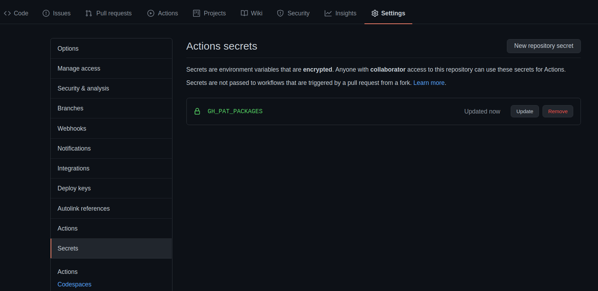
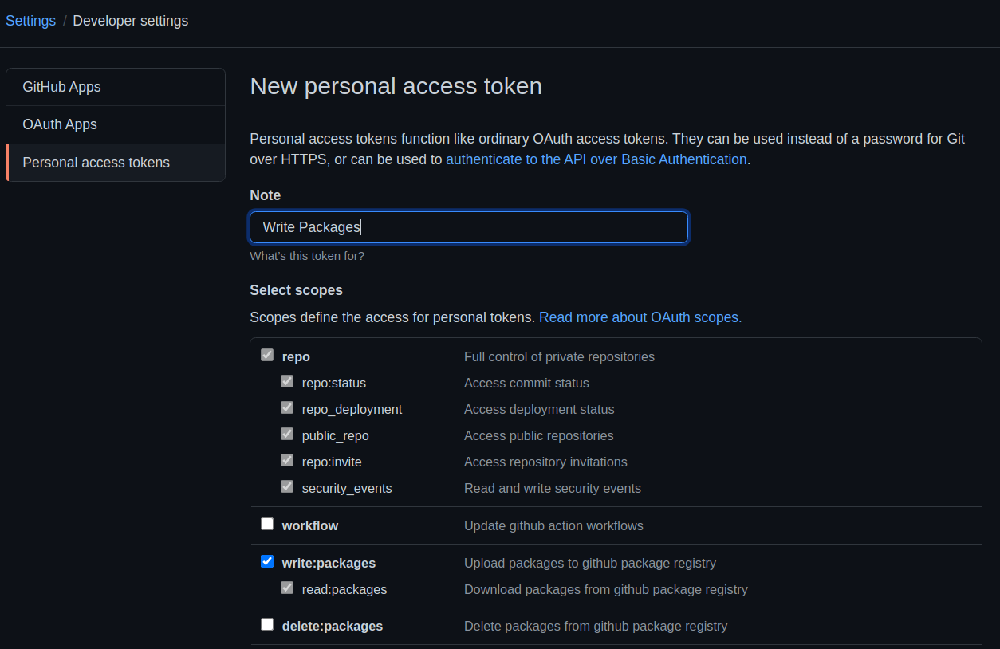

# Python Django Deployment Template
This template has been created for easy deployment of django applications, feel free to use it for other frameworks than django as well.

If you're using this template don't forget to add a personal access token with the privileges to write packages in your repository secrets (`GH_PAT_PACKAGES`):


You can generate this access token in your github account settings (Settings -> Developer settings -> Personal Access Tokens -> Generate new Token):


## Installation
First you need to install [docker](https://docs.docker.com/engine/install/) and [docker-compose](https://docs.docker.com/compose/install/)  
After you have started the services (`docker-compose up -d`), you can collect the static files and create an superuser:  
```bash
# collect static files
docker-compose exec -u0 django /bin/sh -c 'python manage.py collectstatic --no-input'

# create superuser
docker-compose exec django /bin/sh -c 'python manage.py createsuperuser --username=admin --email=admin@example.de'
```

Afterwards you can access the application: [http://localhost:8080](http://localhost:8080)  
You can change the port inside the [`docker-compose.yml`](./docker-compose.yml#L29)
